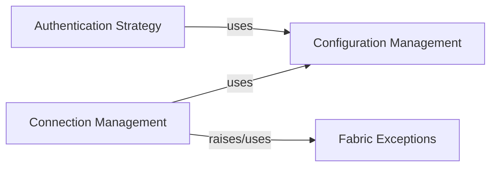

## Component Details

This graph illustrates the core components responsible for managing configuration, authentication, and connections within the Fabric subsystem. The Configuration Management component centralizes all configuration settings, including SSH details. The Authentication Strategy component leverages these configurations to handle secure authentication processes. Connection Management relies on both Configuration Management for connection parameters and Authentication Strategy for secure access, and it also interacts with Fabric Exceptions to signal specific errors during connection operations.

### Configuration Management
Manages Fabric's configuration settings, including loading SSH configurations from various sources (system, user, runtime, Fabric 1 `env` dict). It provides mechanisms to initialize, clone, and load configuration data, and defines default values for Fabric operations.

**Related Classes/Methods**:

- <a href="https://github.com/fabric/fabric/blob/master/fabric/config.py#L12-L331" target="_blank" rel="noopener noreferrer">`fabric.config.Config` (12:331)</a>
- <a href="https://github.com/fabric/fabric/blob/master/fabric/config.py#L42-L102" target="_blank" rel="noopener noreferrer">`fabric.config.Config.from_v1` (42:102)</a>
- <a href="https://github.com/fabric/fabric/blob/master/fabric/config.py#L176-L193" target="_blank" rel="noopener noreferrer">`fabric.config.Config.load_ssh_config` (176:193)</a>
- <a href="https://github.com/fabric/fabric/blob/master/fabric/config.py#L234-L256" target="_blank" rel="noopener noreferrer">`fabric.config.Config._load_ssh_files` (234:256)</a>
- <a href="https://github.com/fabric/fabric/blob/master/fabric/config.py#L258-L274" target="_blank" rel="noopener noreferrer">`fabric.config.Config._load_ssh_file` (258:274)</a>
- <a href="https://github.com/fabric/fabric/blob/master/fabric/config.py#L165-L174" target="_blank" rel="noopener noreferrer">`fabric.config.Config.set_runtime_ssh_path` (165:174)</a>
- <a href="https://github.com/fabric/fabric/blob/master/fabric/config.py#L195-L219" target="_blank" rel="noopener noreferrer">`fabric.config.Config.clone` (195:219)</a>
- <a href="https://github.com/fabric/fabric/blob/master/fabric/config.py#L221-L232" target="_blank" rel="noopener noreferrer">`fabric.config.Config._clone_init_kwargs` (221:232)</a>
- <a href="https://github.com/fabric/fabric/blob/master/fabric/config.py#L277-L331" target="_blank" rel="noopener noreferrer">`fabric.config.Config.global_defaults` (277:331)</a>

### Authentication Strategy
Handles various authentication strategies, specifically focusing on OpenSSH authentication. It manages the retrieval of public keys from SSH agents, configuration files, and default locations, and orchestrates the overall authentication process.

**Related Classes/Methods**:

- <a href="https://github.com/fabric/fabric/blob/master/fabric/auth.py#L16-L207" target="_blank" rel="noopener noreferrer">`fabric.auth.OpenSSHAuthStrategy` (16:207)</a>
- <a href="https://github.com/fabric/fabric/blob/master/fabric/auth.py#L69-L89" target="_blank" rel="noopener noreferrer">`fabric.auth.OpenSSHAuthStrategy.__init__` (69:89)</a>
- <a href="https://github.com/fabric/fabric/blob/master/fabric/auth.py#L184-L193" target="_blank" rel="noopener noreferrer">`fabric.auth.OpenSSHAuthStrategy.get_sources` (184:193)</a>
- <a href="https://github.com/fabric/fabric/blob/master/fabric/auth.py#L91-L182" target="_blank" rel="noopener noreferrer">`fabric.auth.OpenSSHAuthStrategy.get_pubkeys` (91:182)</a>
- <a href="https://github.com/fabric/fabric/blob/master/fabric/auth.py#L195-L200" target="_blank" rel="noopener noreferrer">`fabric.auth.OpenSSHAuthStrategy.authenticate` (195:200)</a>
- <a href="https://github.com/fabric/fabric/blob/master/fabric/auth.py#L202-L207" target="_blank" rel="noopener noreferrer">`fabric.auth.OpenSSHAuthStrategy.close` (202:207)</a>

### Connection Management
Responsible for establishing and managing connections to remote hosts. It handles the derivation of connection shorthand, resolves connection arguments, and integrates with configuration and gateway functionalities.

**Related Classes/Methods**:

- <a href="https://github.com/fabric/fabric/blob/master/fabric/connection.py#L49-L1115" target="_blank" rel="noopener noreferrer">`fabric.connection.Connection` (49:1115)</a>
- <a href="https://github.com/fabric/fabric/blob/master/fabric/connection.py#L145-L200" target="_blank" rel="noopener noreferrer">`fabric.connection.Connection.from_v1` (145:200)</a>
- <a href="https://github.com/fabric/fabric/blob/master/fabric/connection.py#L26-L46" target="_blank" rel="noopener noreferrer">`fabric.connection.derive_shorthand` (26:46)</a>
- <a href="https://github.com/fabric/fabric/blob/master/fabric/connection.py#L209-L469" target="_blank" rel="noopener noreferrer">`fabric.connection.Connection.__init__` (209:469)</a>
- <a href="https://github.com/fabric/fabric/blob/master/fabric/connection.py#L500-L528" target="_blank" rel="noopener noreferrer">`fabric.connection.Connection.get_gateway` (500:528)</a>
- <a href="https://github.com/fabric/fabric/blob/master/fabric/connection.py#L471-L498" target="_blank" rel="noopener noreferrer">`fabric.connection.Connection.resolve_connect_kwargs` (471:498)</a>

### Fabric Exceptions
Provides specific exception classes used within the Fabric subsystem to signal errors, such as issues related to invalid version 1 environments during operations.

**Related Classes/Methods**:

- <a href="https://github.com/fabric/fabric/blob/master/fabric/exceptions.py#L21-L26" target="_blank" rel="noopener noreferrer">`fabric.exceptions.InvalidV1Env` (21:26)</a>

### [FAQ](https://github.com/CodeBoarding/GeneratedOnBoardings/tree/main?tab=readme-ov-file#faq)