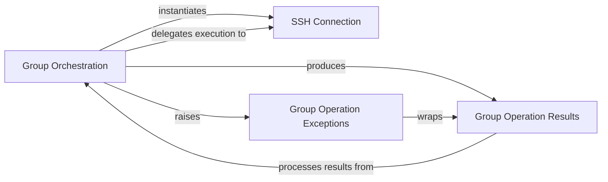

## Component Details

This subsystem orchestrates and executes operations across a group of remote hosts, managing both serial and parallel execution. It leverages individual SSH connections to perform commands and file transfers, aggregates the results of these operations, and provides a structured way to handle exceptions that occur during group execution.

### Group Orchestration
This component provides an abstract interface for managing a collection of SSH connections and executing commands or file transfers across them. It includes concrete implementations for serial and threaded execution, allowing users to perform operations on multiple hosts simultaneously or sequentially.

**Related Classes/Methods**:

- <a href="https://github.com/fabric/fabric/blob/master/fabric/group.py#L9-L201" target="_blank" rel="noopener noreferrer">`fabric.fabric.group.Group` (9:201)</a>
- <a href="https://github.com/fabric/fabric/blob/master/fabric/group.py#L204-L222" target="_blank" rel="noopener noreferrer">`fabric.fabric.group.SerialGroup` (204:222)</a>
- <a href="https://github.com/fabric/fabric/blob/master/fabric/group.py#L231-L283" target="_blank" rel="noopener noreferrer">`fabric.fabric.group.ThreadingGroup` (231:283)</a>
- <a href="https://github.com/fabric/fabric/blob/master/fabric/group.py#L63-L84" target="_blank" rel="noopener noreferrer">`fabric.fabric.group.Group.__init__` (63:84)</a>
- <a href="https://github.com/fabric/fabric/blob/master/fabric/group.py#L87-L97" target="_blank" rel="noopener noreferrer">`fabric.fabric.group.Group.from_connections` (87:97)</a>
- <a href="https://github.com/fabric/fabric/blob/master/fabric/group.py#L104-L116" target="_blank" rel="noopener noreferrer">`fabric.fabric.group.Group.run` (104:116)</a>
- <a href="https://github.com/fabric/fabric/blob/master/fabric/group.py#L118-L127" target="_blank" rel="noopener noreferrer">`fabric.fabric.group.Group.sudo` (118:127)</a>
- <a href="https://github.com/fabric/fabric/blob/master/fabric/group.py#L139-L153" target="_blank" rel="noopener noreferrer">`fabric.fabric.group.Group.put` (139:153)</a>
- <a href="https://github.com/fabric/fabric/blob/master/fabric/group.py#L155-L186" target="_blank" rel="noopener noreferrer">`fabric.fabric.group.Group.get` (155:186)</a>
- <a href="https://github.com/fabric/fabric/blob/master/fabric/group.py#L200-L201" target="_blank" rel="noopener noreferrer">`fabric.fabric.group.Group.__exit__` (200:201)</a>
- <a href="https://github.com/fabric/fabric/blob/master/fabric/group.py#L188-L195" target="_blank" rel="noopener noreferrer">`fabric.fabric.group.Group.close` (188:195)</a>
- <a href="https://github.com/fabric/fabric/blob/master/fabric/group.py#L211-L222" target="_blank" rel="noopener noreferrer">`fabric.fabric.group.SerialGroup._do` (211:222)</a>
- <a href="https://github.com/fabric/fabric/blob/master/fabric/group.py#L238-L283" target="_blank" rel="noopener noreferrer">`fabric.fabric.group.ThreadingGroup._do` (238:283)</a>

### SSH Connection
This component is responsible for establishing, maintaining, and closing individual SSH connections to remote hosts. It provides methods for executing commands, transferring files, and managing SSH agent forwarding and port forwarding.

**Related Classes/Methods**:

- <a href="https://github.com/fabric/fabric/blob/master/fabric/connection.py#L49-L1115" target="_blank" rel="noopener noreferrer">`fabric.fabric.connection.Connection` (49:1115)</a>
- <a href="https://github.com/fabric/fabric/blob/master/fabric/connection.py#L209-L469" target="_blank" rel="noopener noreferrer">`fabric.fabric.connection.Connection.__init__` (209:469)</a>
- <a href="https://github.com/fabric/fabric/blob/master/fabric/connection.py#L709-L728" target="_blank" rel="noopener noreferrer">`fabric.fabric.connection.Connection.close` (709:728)</a>
- <a href="https://github.com/fabric/fabric/blob/master/fabric/connection.py#L749-L763" target="_blank" rel="noopener noreferrer">`fabric.fabric.connection.Connection.run` (749:763)</a>
- <a href="https://github.com/fabric/fabric/blob/master/fabric/connection.py#L766-L777" target="_blank" rel="noopener noreferrer">`fabric.fabric.connection.Connection.sudo` (766:777)</a>
- <a href="https://github.com/fabric/fabric/blob/master/fabric/connection.py#L899-L908" target="_blank" rel="noopener noreferrer">`fabric.fabric.connection.Connection.put` (899:908)</a>
- <a href="https://github.com/fabric/fabric/blob/master/fabric/connection.py#L888-L897" target="_blank" rel="noopener noreferrer">`fabric.fabric.connection.Connection.get` (888:897)</a>

### Group Operation Results
This component encapsulates the results of operations performed across a group of connections. It acts as a dictionary mapping connections to their individual outcomes (either a successful result or an exception) and provides convenience methods to separate successful and failed operations.

**Related Classes/Methods**:

- <a href="https://github.com/fabric/fabric/blob/master/fabric/group.py#L286-L342" target="_blank" rel="noopener noreferrer">`fabric.fabric.group.GroupResult` (286:342)</a>
- <a href="https://github.com/fabric/fabric/blob/master/fabric/group.py#L307-L310" target="_blank" rel="noopener noreferrer">`fabric.fabric.group.GroupResult.__init__` (307:310)</a>
- <a href="https://github.com/fabric/fabric/blob/master/fabric/group.py#L325-L332" target="_blank" rel="noopener noreferrer">`fabric.fabric.group.GroupResult.succeeded` (325:332)</a>
- <a href="https://github.com/fabric/fabric/blob/master/fabric/group.py#L335-L342" target="_blank" rel="noopener noreferrer">`fabric.fabric.group.GroupResult.failed` (335:342)</a>
- <a href="https://github.com/fabric/fabric/blob/master/fabric/group.py#L312-L322" target="_blank" rel="noopener noreferrer">`fabric.fabric.group.GroupResult._bifurcate` (312:322)</a>

### Group Operation Exceptions
This component defines a specific exception type that is raised when one or more operations within a group of connections fail. It wraps the GroupResult object, allowing the caller to inspect both successful and failed outcomes.

**Related Classes/Methods**:

- <a href="https://github.com/fabric/fabric/blob/master/fabric/exceptions.py#L7-L18" target="_blank" rel="noopener noreferrer">`fabric.fabric.exceptions.GroupException` (7:18)</a>
- <a href="https://github.com/fabric/fabric/blob/master/fabric/exceptions.py#L14-L18" target="_blank" rel="noopener noreferrer">`fabric.fabric.exceptions.GroupException.__init__` (14:18)</a>

### [FAQ](https://github.com/CodeBoarding/GeneratedOnBoardings/tree/main?tab=readme-ov-file#faq)