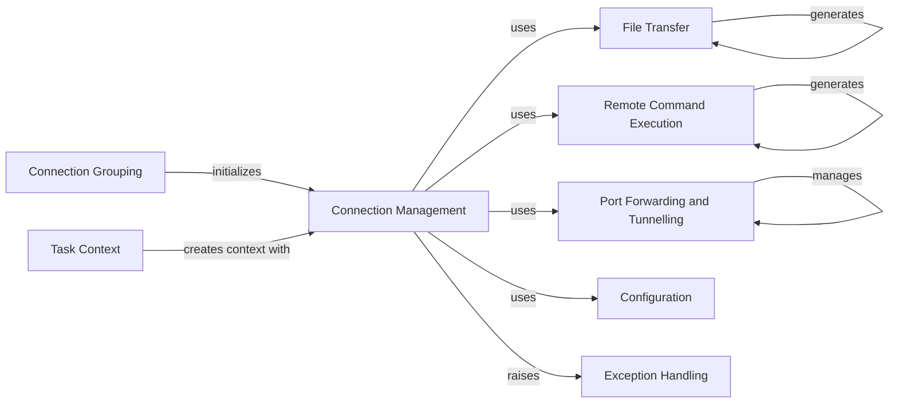

## Component Details

The SSHClientCore subsystem provides the fundamental capabilities for interacting with remote hosts via SSH. It encompasses components for managing individual SSH connections, executing commands, transferring files, and establishing secure tunnels. The core flow involves establishing a connection, performing desired operations (command execution, file transfer, or port forwarding), and then closing the connection. Configuration settings are applied globally, and specific exceptions are raised for error handling. Connection grouping allows for managing multiple connections, and task contexts facilitate the execution of operations within a defined connection scope.

### Connection Management
This component is responsible for establishing, managing, and closing SSH connections to remote hosts. It handles connection parameters, gateway configurations, and provides core methods for interacting with the remote system, such as running commands, transferring files, and setting up port forwards.

**Related Classes/Methods**:

- <a href="https://github.com/fabric/fabric/blob/master/fabric/connection.py#L49-L1115" target="_blank" rel="noopener noreferrer">`fabric.connection.Connection` (49:1115)</a>
- <a href="https://github.com/fabric/fabric/blob/master/fabric/connection.py#L589-L667" target="_blank" rel="noopener noreferrer">`fabric.connection.Connection.open` (589:667)</a>
- <a href="https://github.com/fabric/fabric/blob/master/fabric/connection.py#L709-L728" target="_blank" rel="noopener noreferrer">`fabric.connection.Connection.close` (709:728)</a>
- <a href="https://github.com/fabric/fabric/blob/master/fabric/connection.py#L500-L528" target="_blank" rel="noopener noreferrer">`fabric.connection.Connection.get_gateway` (500:528)</a>
- <a href="https://github.com/fabric/fabric/blob/master/fabric/connection.py#L669-L707" target="_blank" rel="noopener noreferrer">`fabric.connection.Connection.open_gateway` (669:707)</a>
- <a href="https://github.com/fabric/fabric/blob/master/fabric/connection.py#L749-L763" target="_blank" rel="noopener noreferrer">`fabric.connection.Connection.run` (749:763)</a>
- <a href="https://github.com/fabric/fabric/blob/master/fabric/connection.py#L766-L777" target="_blank" rel="noopener noreferrer">`fabric.connection.Connection.sudo` (766:777)</a>
- <a href="https://github.com/fabric/fabric/blob/master/fabric/connection.py#L888-L897" target="_blank" rel="noopener noreferrer">`fabric.connection.Connection.get` (888:897)</a>
- <a href="https://github.com/fabric/fabric/blob/master/fabric/connection.py#L899-L908" target="_blank" rel="noopener noreferrer">`fabric.connection.Connection.put` (899:908)</a>
- <a href="https://github.com/fabric/fabric/blob/master/fabric/connection.py#L915-L1005" target="_blank" rel="noopener noreferrer">`fabric.connection.Connection.forward_local` (915:1005)</a>
- <a href="https://github.com/fabric/fabric/blob/master/fabric/connection.py#L1014-L1115" target="_blank" rel="noopener noreferrer">`fabric.connection.Connection.forward_remote` (1014:1115)</a>
- <a href="https://github.com/fabric/fabric/blob/master/fabric/connection.py#L145-L200" target="_blank" rel="noopener noreferrer">`fabric.connection.Connection:from_v1` (145:200)</a>
- <a href="https://github.com/fabric/fabric/blob/master/fabric/connection.py#L209-L469" target="_blank" rel="noopener noreferrer">`fabric.connection.Connection:__init__` (209:469)</a>
- <a href="https://github.com/fabric/fabric/blob/master/fabric/connection.py#L561-L564" target="_blank" rel="noopener noreferrer">`fabric.connection.Connection:__eq__` (561:564)</a>
- <a href="https://github.com/fabric/fabric/blob/master/fabric/connection.py#L566-L567" target="_blank" rel="noopener noreferrer">`fabric.connection.Connection:__lt__` (566:567)</a>
- <a href="https://github.com/fabric/fabric/blob/master/fabric/connection.py#L569-L572" target="_blank" rel="noopener noreferrer">`fabric.connection.Connection:__hash__` (569:572)</a>
- <a href="https://github.com/fabric/fabric/blob/master/fabric/connection.py#L574-L578" target="_blank" rel="noopener noreferrer">`fabric.connection.Connection:derive_shorthand` (574:578)</a>
- <a href="https://github.com/fabric/fabric/blob/master/fabric/connection.py#L733-L734" target="_blank" rel="noopener noreferrer">`fabric.connection.Connection:__exit__` (733:734)</a>
- <a href="https://github.com/fabric/fabric/blob/master/fabric/connection.py#L26-L46" target="_blank" rel="noopener noreferrer">`fabric.connection.derive_shorthand` (26:46)</a>

### File Transfer
This component handles the secure transfer of files between the local and remote filesystems over an established SSH connection. It provides methods for both uploading (put) and downloading (get) files.

**Related Classes/Methods**:

- <a href="https://github.com/fabric/fabric/blob/master/fabric/transfer.py#L21-L323" target="_blank" rel="noopener noreferrer">`fabric.fabric.transfer.Transfer` (21:323)</a>
- <a href="https://github.com/fabric/fabric/blob/master/fabric/transfer.py#L43-L185" target="_blank" rel="noopener noreferrer">`fabric.fabric.transfer.Transfer.get` (43:185)</a>
- <a href="https://github.com/fabric/fabric/blob/master/fabric/transfer.py#L187-L323" target="_blank" rel="noopener noreferrer">`fabric.fabric.transfer.Transfer.put` (187:323)</a>
- <a href="https://github.com/fabric/fabric/blob/master/fabric/transfer.py#L326-L361" target="_blank" rel="noopener noreferrer">`fabric.fabric.transfer.Result` (326:361)</a>
- <a href="https://github.com/fabric/fabric/blob/master/fabric/transfer.py#L37-L41" target="_blank" rel="noopener noreferrer">`fabric.fabric.transfer.Transfer.is_remote_dir` (37:41)</a>

### Remote Command Execution
This component is responsible for executing shell commands on the remote host. It manages the execution process, handles input/output streams, and generates results from the command execution.

**Related Classes/Methods**:

- <a href="https://github.com/fabric/fabric/blob/master/fabric/runners.py#L14-L145" target="_blank" rel="noopener noreferrer">`fabric.fabric.runners.Remote` (14:145)</a>
- <a href="https://github.com/fabric/fabric/blob/master/fabric/runners.py#L48-L76" target="_blank" rel="noopener noreferrer">`fabric.fabric.runners.Remote.start` (48:76)</a>
- <a href="https://github.com/fabric/fabric/blob/master/fabric/runners.py#L124-L129" target="_blank" rel="noopener noreferrer">`fabric.fabric.runners.Remote.stop` (124:129)</a>
- <a href="https://github.com/fabric/fabric/blob/master/fabric/runners.py#L120-L122" target="_blank" rel="noopener noreferrer">`fabric.fabric.runners.Remote.generate_result` (120:122)</a>
- <a href="https://github.com/fabric/fabric/blob/master/fabric/runners.py#L172-L186" target="_blank" rel="noopener noreferrer">`fabric.fabric.runners.Result` (172:186)</a>
- <a href="https://github.com/fabric/fabric/blob/master/fabric/runners.py#L78-L79" target="_blank" rel="noopener noreferrer">`fabric.fabric.runners.Remote.send_start_message` (78:79)</a>
- <a href="https://github.com/fabric/fabric/blob/master/fabric/runners.py#L7-L11" target="_blank" rel="noopener noreferrer">`fabric.fabric.runners.cares_about_SIGWINCH` (7:11)</a>

### Port Forwarding and Tunnelling
This component facilitates the creation and management of SSH tunnels for port forwarding. It supports both local-to-remote and remote-to-local forwarding, allowing network traffic to be securely routed through the SSH connection.

**Related Classes/Methods**:

- <a href="https://github.com/fabric/fabric/blob/master/fabric/tunnels.py#L17-L106" target="_blank" rel="noopener noreferrer">`fabric.fabric.tunnels.TunnelManager` (17:106)</a>
- <a href="https://github.com/fabric/fabric/blob/master/fabric/tunnels.py#L109-L154" target="_blank" rel="noopener noreferrer">`fabric.fabric.tunnels.Tunnel` (109:154)</a>
- <a href="https://github.com/fabric/fabric/blob/master/fabric/tunnels.py#L47-L106" target="_blank" rel="noopener noreferrer">`fabric.fabric.tunnels.TunnelManager:_run` (47:106)</a>
- <a href="https://github.com/fabric/fabric/blob/master/fabric/tunnels.py#L124-L141" target="_blank" rel="noopener noreferrer">`fabric.fabric.tunnels.Tunnel:_run` (124:141)</a>
- <a href="https://github.com/fabric/fabric/blob/master/fabric/tunnels.py#L143-L154" target="_blank" rel="noopener noreferrer">`fabric.fabric.tunnels.Tunnel.read_and_write` (143:154)</a>

### Configuration
This component provides a centralized mechanism for managing configuration settings across the Fabric system. It allows for default values, user-defined overrides, and integration with SSH configuration files.

**Related Classes/Methods**:

- <a href="https://github.com/fabric/fabric/blob/master/fabric/config.py#L12-L331" target="_blank" rel="noopener noreferrer">`fabric.fabric.config.Config` (12:331)</a>
- <a href="https://github.com/fabric/fabric/blob/master/fabric/config.py#L42-L102" target="_blank" rel="noopener noreferrer">`fabric.fabric.config.Config.from_v1` (42:102)</a>

### Exception Handling
This component defines custom exceptions specific to the Fabric subsystem, allowing for more granular error management and clearer communication of issues, such as invalid environment configurations.

**Related Classes/Methods**:

- <a href="https://github.com/fabric/fabric/blob/master/fabric/exceptions.py#L21-L26" target="_blank" rel="noopener noreferrer">`fabric.fabric.exceptions.InvalidV1Env` (21:26)</a>

### Connection Grouping
This component provides functionality for organizing and managing collections of SSH connections, enabling operations to be performed across multiple hosts efficiently.

**Related Classes/Methods**:

- <a href="https://github.com/fabric/fabric/blob/master/fabric/group.py#L9-L201" target="_blank" rel="noopener noreferrer">`fabric.fabric.group.Group` (9:201)</a>
- <a href="https://github.com/fabric/fabric/blob/master/fabric/group.py#L63-L84" target="_blank" rel="noopener noreferrer">`fabric.fabric.group.Group:__init__` (63:84)</a>

### Task Context
This component is responsible for creating and managing the execution context for tasks, often involving the association of a specific connection with the task's operations.

**Related Classes/Methods**:

- <a href="https://github.com/fabric/fabric/blob/master/fabric/tasks.py#L74-L116" target="_blank" rel="noopener noreferrer">`fabric.fabric.tasks.ConnectionCall` (74:116)</a>
- <a href="https://github.com/fabric/fabric/blob/master/fabric/tasks.py#L104-L110" target="_blank" rel="noopener noreferrer">`fabric.fabric.tasks.ConnectionCall:make_context` (104:110)</a>

### [FAQ](https://github.com/CodeBoarding/GeneratedOnBoardings/tree/main?tab=readme-ov-file#faq)