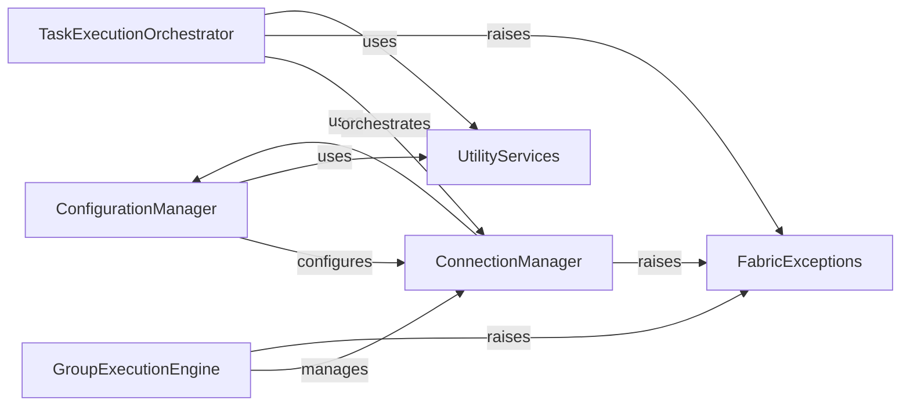

## Component Details

This architecture overview describes the core components of Fabric, a Python library for streamlining SSH-based application deployment and system administration tasks. It details how configuration settings are managed, how SSH connections are established and utilized for command execution and file transfers, how operations are handled across multiple hosts, and how task execution is orchestrated. Additionally, it highlights the utility functions and custom exception handling mechanisms that support these core functionalities.

### ConfigurationManager
This component is responsible for managing Fabric's configuration settings, including global defaults, SSH configuration, and compatibility with Fabric 1's env dictionary. It provides the foundational settings for establishing connections and executing commands.

**Related Classes/Methods**:

- <a href="https://github.com/fabric/fabric/blob/master/fabric/config.py#L12-L331" target="_blank" rel="noopener noreferrer">`fabric.fabric.config.Config` (12:331)</a>
- <a href="https://github.com/fabric/fabric/blob/master/fabric/config.py#L277-L331" target="_blank" rel="noopener noreferrer">`fabric.fabric.config.Config:global_defaults` (277:331)</a>
- <a href="https://github.com/fabric/fabric/blob/master/fabric/config.py#L42-L102" target="_blank" rel="noopener noreferrer">`fabric.fabric.config.Config:from_v1` (42:102)</a>

### ConnectionManager
This component handles the lifecycle of individual SSH connections to remote hosts. It provides methods for opening and closing connections, executing remote shell commands (run, sudo, shell), performing file transfers (get, put), and setting up port forwarding. It relies on the ConfigurationManager for its default settings.

**Related Classes/Methods**:

- <a href="https://github.com/fabric/fabric/blob/master/fabric/connection.py#L49-L1115" target="_blank" rel="noopener noreferrer">`fabric.fabric.connection.Connection` (49:1115)</a>
- <a href="https://github.com/fabric/fabric/blob/master/fabric/connection.py#L145-L200" target="_blank" rel="noopener noreferrer">`fabric.fabric.connection.Connection:from_v1` (145:200)</a>
- <a href="https://github.com/fabric/fabric/blob/master/fabric/connection.py#L589-L667" target="_blank" rel="noopener noreferrer">`fabric.fabric.connection.Connection:open` (589:667)</a>
- <a href="https://github.com/fabric/fabric/blob/master/fabric/connection.py#L749-L763" target="_blank" rel="noopener noreferrer">`fabric.fabric.connection.Connection:run` (749:763)</a>
- <a href="https://github.com/fabric/fabric/blob/master/fabric/connection.py#L766-L777" target="_blank" rel="noopener noreferrer">`fabric.fabric.connection.Connection:sudo` (766:777)</a>
- <a href="https://github.com/fabric/fabric/blob/master/fabric/connection.py#L780-L857" target="_blank" rel="noopener noreferrer">`fabric.fabric.connection.Connection:shell` (780:857)</a>
- <a href="https://github.com/fabric/fabric/blob/master/fabric/connection.py#L859-L870" target="_blank" rel="noopener noreferrer">`fabric.fabric.connection.Connection:local` (859:870)</a>
- <a href="https://github.com/fabric/fabric/blob/master/fabric/connection.py#L873-L886" target="_blank" rel="noopener noreferrer">`fabric.fabric.connection.Connection:sftp` (873:886)</a>
- <a href="https://github.com/fabric/fabric/blob/master/fabric/connection.py#L888-L897" target="_blank" rel="noopener noreferrer">`fabric.fabric.connection.Connection:get` (888:897)</a>
- <a href="https://github.com/fabric/fabric/blob/master/fabric/connection.py#L899-L908" target="_blank" rel="noopener noreferrer">`fabric.fabric.connection.Connection:put` (899:908)</a>
- <a href="https://github.com/fabric/fabric/blob/master/fabric/connection.py#L915-L1005" target="_blank" rel="noopener noreferrer">`fabric.fabric.connection.Connection:forward_local` (915:1005)</a>
- <a href="https://github.com/fabric/fabric/blob/master/fabric/connection.py#L1014-L1115" target="_blank" rel="noopener noreferrer">`fabric.fabric.connection.Connection:forward_remote` (1014:1115)</a>
- <a href="https://github.com/fabric/fabric/blob/master/fabric/connection.py#L26-L46" target="_blank" rel="noopener noreferrer">`fabric.fabric.connection.derive_shorthand` (26:46)</a>

### GroupExecutionEngine
This component enables the execution of operations across multiple SSH connections, either sequentially or in parallel using threads. It aggregates the results from each connection into a GroupResult object and raises a GroupException if any operation fails within the group.

**Related Classes/Methods**:

- <a href="https://github.com/fabric/fabric/blob/master/fabric/group.py#L9-L201" target="_blank" rel="noopener noreferrer">`fabric.fabric.group.Group` (9:201)</a>
- <a href="https://github.com/fabric/fabric/blob/master/fabric/group.py#L204-L222" target="_blank" rel="noopener noreferrer">`fabric.fabric.group.SerialGroup` (204:222)</a>
- <a href="https://github.com/fabric/fabric/blob/master/fabric/group.py#L231-L283" target="_blank" rel="noopener noreferrer">`fabric.fabric.group.ThreadingGroup` (231:283)</a>
- <a href="https://github.com/fabric/fabric/blob/master/fabric/group.py#L211-L222" target="_blank" rel="noopener noreferrer">`fabric.fabric.group.SerialGroup:_do` (211:222)</a>
- <a href="https://github.com/fabric/fabric/blob/master/fabric/group.py#L238-L283" target="_blank" rel="noopener noreferrer">`fabric.fabric.group.ThreadingGroup:_do` (238:283)</a>
- <a href="https://github.com/fabric/fabric/blob/master/fabric/group.py#L286-L342" target="_blank" rel="noopener noreferrer">`fabric.fabric.group.GroupResult` (286:342)</a>
- <a href="https://github.com/fabric/fabric/blob/master/fabric/group.py#L225-L228" target="_blank" rel="noopener noreferrer">`fabric.fabric.group.thread_worker` (225:228)</a>

### TaskExecutionOrchestrator
This component extends the base Invoke executor to manage the execution of Fabric tasks, specifically handling the expansion of task calls to run on multiple specified hosts. It ensures that tasks are correctly parameterized for each connection and can raise an exception if no hosts are provided for a command.

**Related Classes/Methods**:

- <a href="https://github.com/fabric/fabric/blob/master/fabric/executor.py#L9-L127" target="_blank" rel="noopener noreferrer">`fabric.fabric.executor.Executor` (9:127)</a>
- <a href="https://github.com/fabric/fabric/blob/master/fabric/executor.py#L24-L48" target="_blank" rel="noopener noreferrer">`fabric.fabric.executor.Executor:normalize_hosts` (24:48)</a>
- <a href="https://github.com/fabric/fabric/blob/master/fabric/executor.py#L50-L99" target="_blank" rel="noopener noreferrer">`fabric.fabric.executor.Executor:expand_calls` (50:99)</a>
- <a href="https://github.com/fabric/fabric/blob/master/fabric/executor.py#L101-L120" target="_blank" rel="noopener noreferrer">`fabric.fabric.executor.Executor:parameterize` (101:120)</a>
- <a href="https://github.com/fabric/fabric/blob/master/fabric/executor.py#L122-L127" target="_blank" rel="noopener noreferrer">`fabric.fabric.executor.Executor:dedupe` (122:127)</a>

### FabricExceptions
This component defines a set of custom exception classes used throughout the Fabric library to signal specific error conditions, such as an invalid Fabric 1 environment, a general failure during group operations, or the absence of tasks to execute.

**Related Classes/Methods**:

- <a href="https://github.com/fabric/fabric/blob/master/fabric/exceptions.py#L3-L4" target="_blank" rel="noopener noreferrer">`fabric.fabric.exceptions.NothingToDo` (3:4)</a>
- <a href="https://github.com/fabric/fabric/blob/master/fabric/exceptions.py#L7-L18" target="_blank" rel="noopener noreferrer">`fabric.fabric.exceptions.GroupException` (7:18)</a>
- <a href="https://github.com/fabric/fabric/blob/master/fabric/exceptions.py#L21-L26" target="_blank" rel="noopener noreferrer">`fabric.fabric.exceptions.InvalidV1Env` (21:26)</a>

### UtilityServices
Provides common utility functions used across various Fabric components, such as retrieving local user information.

**Related Classes/Methods**:

- <a href="https://github.com/fabric/fabric/blob/master/fabric/util.py#L16-L45" target="_blank" rel="noopener noreferrer">`fabric.fabric.util.get_local_user` (16:45)</a>

### [FAQ](https://github.com/CodeBoarding/GeneratedOnBoardings/tree/main?tab=readme-ov-file#faq)