```mermaid
graph LR
    SSHClientCore["SSHClientCore"]
    GroupOrchestrator["GroupOrchestrator"]
    ConfigAuthManager["ConfigAuthManager"]
    AppTaskProcessor["AppTaskProcessor"]
    UtilityServices["UtilityServices"]
    AppTaskProcessor -- "prepares tasks for" --> SSHClientCore
    AppTaskProcessor -- "prepares tasks for" --> GroupOrchestrator
    SSHClientCore -- "uses for configuration and authentication" --> ConfigAuthManager
    GroupOrchestrator -- "operates on collections of" --> SSHClientCore
    ConfigAuthManager -- "uses" --> UtilityServices
    SSHClientCore -- "uses" --> UtilityServices
    AppTaskProcessor -- "uses" --> UtilityServices
    click SSHClientCore href "https://github.com/CodeBoarding/GeneratedOnBoardings/blob/main/fabric/SSHClientCore.md" "Details"
    click GroupOrchestrator href "https://github.com/CodeBoarding/GeneratedOnBoardings/blob/main/fabric/GroupOrchestrator.md" "Details"
    click ConfigAuthManager href "https://github.com/CodeBoarding/GeneratedOnBoardings/blob/main/fabric/ConfigAuthManager.md" "Details"
    click AppTaskProcessor href "https://github.com/CodeBoarding/GeneratedOnBoardings/blob/main/fabric/AppTaskProcessor.md" "Details"
    click UtilityServices href "https://github.com/CodeBoarding/GeneratedOnBoardings/blob/main/fabric/UtilityServices.md" "Details"
```

## Component Details

The Fabric architecture is designed to facilitate secure and efficient remote execution and file transfer over SSH. Its core functionality revolves around managing individual SSH connections and orchestrating operations across multiple hosts. A dedicated configuration and authentication system ensures secure access, while a task processing layer prepares and expands user commands for execution. Supporting these primary functions are various utility services and a robust exception handling mechanism to manage operational errors.

### SSHClientCore
Manages individual SSH connections, executes remote commands, handles file transfers, and establishes SSH tunnels. It forms the fundamental layer for interacting with remote hosts.

**Related Classes/Methods**:

- <a href="https://github.com/fabric/fabric/blob/master/fabric/connection.py#L49-L1115" target="_blank" rel="noopener noreferrer">`fabric.connection.Connection` (49:1115)</a>
- <a href="https://github.com/fabric/fabric/blob/master/fabric/connection.py#L589-L667" target="_blank" rel="noopener noreferrer">`fabric.connection.Connection.open` (589:667)</a>
- <a href="https://github.com/fabric/fabric/blob/master/fabric/connection.py#L709-L728" target="_blank" rel="noopener noreferrer">`fabric.connection.Connection.close` (709:728)</a>
- <a href="https://github.com/fabric/fabric/blob/master/fabric/connection.py#L500-L528" target="_blank" rel="noopener noreferrer">`fabric.connection.Connection.get_gateway` (500:528)</a>
- <a href="https://github.com/fabric/fabric/blob/master/fabric/connection.py#L669-L707" target="_blank" rel="noopener noreferrer">`fabric.connection.Connection.open_gateway` (669:707)</a>
- <a href="https://github.com/fabric/fabric/blob/master/fabric/connection.py#L749-L763" target="_blank" rel="noopener noreferrer">`fabric.connection.Connection.run` (749:763)</a>
- <a href="https://github.com/fabric/fabric/blob/master/fabric/connection.py#L766-L777" target="_blank" rel="noopener noreferrer">`fabric.connection.Connection.sudo` (766:777)</a>
- <a href="https://github.com/fabric/fabric/blob/master/fabric/connection.py#L888-L897" target="_blank" rel="noopener noreferrer">`fabric.connection.Connection.get` (888:897)</a>
- <a href="https://github.com/fabric/fabric/blob/master/fabric/connection.py#L899-L908" target="_blank" rel="noopener noreferrer">`fabric.connection.Connection.put` (899:908)</a>
- <a href="https://github.com/fabric/fabric/blob/master/fabric/connection.py#L915-L1005" target="_blank" rel="noopener noreferrer">`fabric.connection.Connection.forward_local` (915:1005)</a>
- <a href="https://github.com/fabric/fabric/blob/master/fabric/connection.py#L1014-L1115" target="_blank" rel="noopener noreferrer">`fabric.connection.Connection.forward_remote` (1014:1115)</a>
- <a href="https://github.com/fabric/fabric/blob/master/fabric/runners.py#L14-L145" target="_blank" rel="noopener noreferrer">`fabric.fabric.runners.Remote` (14:145)</a>
- <a href="https://github.com/fabric/fabric/blob/master/fabric/runners.py#L48-L76" target="_blank" rel="noopener noreferrer">`fabric.fabric.runners.Remote.start` (48:76)</a>
- <a href="https://github.com/fabric/fabric/blob/master/fabric/runners.py#L124-L129" target="_blank" rel="noopener noreferrer">`fabric.fabric.runners.Remote.stop` (124:129)</a>
- <a href="https://github.com/fabric/fabric/blob/master/fabric/runners.py#L120-L122" target="_blank" rel="noopener noreferrer">`fabric.fabric.runners.Remote.generate_result` (120:122)</a>
- <a href="https://github.com/fabric/fabric/blob/master/fabric/runners.py#L172-L186" target="_blank" rel="noopener noreferrer">`fabric.fabric.runners.Result` (172:186)</a>
- <a href="https://github.com/fabric/fabric/blob/master/fabric/transfer.py#L21-L323" target="_blank" rel="noopener noreferrer">`fabric.fabric.transfer.Transfer` (21:323)</a>
- <a href="https://github.com/fabric/fabric/blob/master/fabric/transfer.py#L43-L185" target="_blank" rel="noopener noreferrer">`fabric.fabric.transfer.Transfer.get` (43:185)</a>
- <a href="https://github.com/fabric/fabric/blob/master/fabric/transfer.py#L187-L323" target="_blank" rel="noopener noreferrer">`fabric.fabric.transfer.Transfer.put` (187:323)</a>
- <a href="https://github.com/fabric/fabric/blob/master/fabric/transfer.py#L326-L361" target="_blank" rel="noopener noreferrer">`fabric.fabric.transfer.Result` (326:361)</a>
- <a href="https://github.com/fabric/fabric/blob/master/fabric/tunnels.py#L17-L106" target="_blank" rel="noopener noreferrer">`fabric.fabric.tunnels.TunnelManager` (17:106)</a>
- <a href="https://github.com/fabric/fabric/blob/master/fabric/tunnels.py#L109-L154" target="_blank" rel="noopener noreferrer">`fabric.fabric.tunnels.Tunnel` (109:154)</a>

### GroupOrchestrator
Orchestrates and executes operations (commands, file transfers) across a defined group of remote hosts, managing serial or parallel execution and aggregating results.

**Related Classes/Methods**:

- <a href="https://github.com/fabric/fabric/blob/master/fabric/group.py#L9-L201" target="_blank" rel="noopener noreferrer">`fabric.fabric.group.Group` (9:201)</a>
- <a href="https://github.com/fabric/fabric/blob/master/fabric/group.py#L204-L222" target="_blank" rel="noopener noreferrer">`fabric.fabric.group.SerialGroup` (204:222)</a>
- <a href="https://github.com/fabric/fabric/blob/master/fabric/group.py#L231-L283" target="_blank" rel="noopener noreferrer">`fabric.fabric.group.ThreadingGroup` (231:283)</a>
- <a href="https://github.com/fabric/fabric/blob/master/fabric/group.py#L104-L116" target="_blank" rel="noopener noreferrer">`fabric.fabric.group.Group.run` (104:116)</a>
- <a href="https://github.com/fabric/fabric/blob/master/fabric/group.py#L118-L127" target="_blank" rel="noopener noreferrer">`fabric.fabric.group.Group.sudo` (118:127)</a>
- <a href="https://github.com/fabric/fabric/blob/master/fabric/group.py#L139-L153" target="_blank" rel="noopener noreferrer">`fabric.fabric.group.Group.put` (139:153)</a>
- <a href="https://github.com/fabric/fabric/blob/master/fabric/group.py#L155-L186" target="_blank" rel="noopener noreferrer">`fabric.fabric.group.Group.get` (155:186)</a>
- <a href="https://github.com/fabric/fabric/blob/master/fabric/group.py#L286-L342" target="_blank" rel="noopener noreferrer">`fabric.fabric.group.GroupResult` (286:342)</a>

### ConfigAuthManager
Manages Fabric's configuration settings, including loading SSH configurations, and handles authentication processes for establishing secure connections.

**Related Classes/Methods**:

- <a href="https://github.com/fabric/fabric/blob/master/fabric/config.py#L12-L331" target="_blank" rel="noopener noreferrer">`fabric.fabric.config.Config` (12:331)</a>
- <a href="https://github.com/fabric/fabric/blob/master/fabric/config.py#L42-L102" target="_blank" rel="noopener noreferrer">`fabric.fabric.config.Config.from_v1` (42:102)</a>
- <a href="https://github.com/fabric/fabric/blob/master/fabric/config.py#L176-L193" target="_blank" rel="noopener noreferrer">`fabric.fabric.config.Config.load_ssh_config` (176:193)</a>
- <a href="https://github.com/fabric/fabric/blob/master/fabric/config.py#L234-L256" target="_blank" rel="noopener noreferrer">`fabric.fabric.config.Config._load_ssh_files` (234:256)</a>
- <a href="https://github.com/fabric/fabric/blob/master/fabric/config.py#L258-L274" target="_blank" rel="noopener noreferrer">`fabric.fabric.config.Config._load_ssh_file` (258:274)</a>
- <a href="https://github.com/fabric/fabric/blob/master/fabric/config.py#L165-L174" target="_blank" rel="noopener noreferrer">`fabric.fabric.config.Config.set_runtime_ssh_path` (165:174)</a>
- <a href="https://github.com/fabric/fabric/blob/master/fabric/auth.py#L16-L207" target="_blank" rel="noopener noreferrer">`fabric.fabric.auth.OpenSSHAuthStrategy` (16:207)</a>
- <a href="https://github.com/fabric/fabric/blob/master/fabric/auth.py#L184-L193" target="_blank" rel="noopener noreferrer">`fabric.fabric.auth.OpenSSHAuthStrategy.get_sources` (184:193)</a>
- <a href="https://github.com/fabric/fabric/blob/master/fabric/auth.py#L91-L182" target="_blank" rel="noopener noreferrer">`fabric.fabric.auth.OpenSSHAuthStrategy.get_pubkeys` (91:182)</a>
- <a href="https://github.com/fabric/fabric/blob/master/fabric/auth.py#L195-L200" target="_blank" rel="noopener noreferrer">`fabric.fabric.auth.OpenSSHAuthStrategy.authenticate` (195:200)</a>
- <a href="https://github.com/fabric/fabric/blob/master/fabric/auth.py#L202-L207" target="_blank" rel="noopener noreferrer">`fabric.fabric.auth.OpenSSHAuthStrategy.close` (202:207)</a>

### AppTaskProcessor
Serves as the main entry point for the Fabric application, responsible for initializing the core program and preparing/expanding user-defined tasks for execution.

**Related Classes/Methods**:

- <a href="https://github.com/fabric/fabric/blob/master/fabric/executor.py#L9-L127" target="_blank" rel="noopener noreferrer">`fabric.fabric.executor.Executor` (9:127)</a>
- <a href="https://github.com/fabric/fabric/blob/master/fabric/executor.py#L50-L99" target="_blank" rel="noopener noreferrer">`fabric.fabric.executor.Executor.expand_calls` (50:99)</a>
- <a href="https://github.com/fabric/fabric/blob/master/fabric/executor.py#L24-L48" target="_blank" rel="noopener noreferrer">`fabric.fabric.executor.Executor.normalize_hosts` (24:48)</a>
- <a href="https://github.com/fabric/fabric/blob/master/fabric/executor.py#L101-L120" target="_blank" rel="noopener noreferrer">`fabric.fabric.executor.Executor.parameterize` (101:120)</a>
- <a href="https://github.com/fabric/fabric/blob/master/fabric/main.py#L18-L180" target="_blank" rel="noopener noreferrer">`fabric.fabric.main.Fab` (18:180)</a>
- <a href="https://github.com/fabric/fabric/blob/master/fabric/main.py#L184-L190" target="_blank" rel="noopener noreferrer">`fabric.fabric.main.make_program` (184:190)</a>

### UtilityServices
Provides common utility functions used across various Fabric components, such as retrieving local user information, and defines custom exceptions for error handling.

**Related Classes/Methods**:

- <a href="https://github.com/fabric/fabric/blob/master/fabric/util.py#L16-L45" target="_blank" rel="noopener noreferrer">`fabric.fabric.util.get_local_user` (16:45)</a>
- <a href="https://github.com/fabric/fabric/blob/master/fabric/exceptions.py#L21-L26" target="_blank" rel="noopener noreferrer">`fabric.fabric.exceptions.InvalidV1Env` (21:26)</a>
- <a href="https://github.com/fabric/fabric/blob/master/fabric/exceptions.py#L7-L18" target="_blank" rel="noopener noreferrer">`fabric.fabric.exceptions.GroupException` (7:18)</a>
- <a href="https://github.com/fabric/fabric/blob/master/fabric/exceptions.py#L3-L4" target="_blank" rel="noopener noreferrer">`fabric.fabric.exceptions.NothingToDo` (3:4)</a>

### [FAQ](https://github.com/CodeBoarding/GeneratedOnBoardings/tree/main?tab=readme-ov-file#faq)